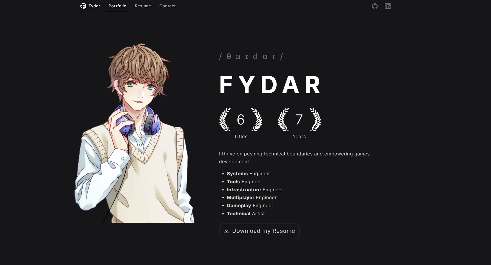

<h1>

Portfolio
</h1>

 

An **[ASP.NET Core](https://dotnet.microsoft.com/apps/aspnet)** application hosting my porfolio.

## PageSpeed Insights

Using **PageSpeed Insights** allowed me to identify issues with my website, and after much iteration I reached 100% on all 4 statistics.

