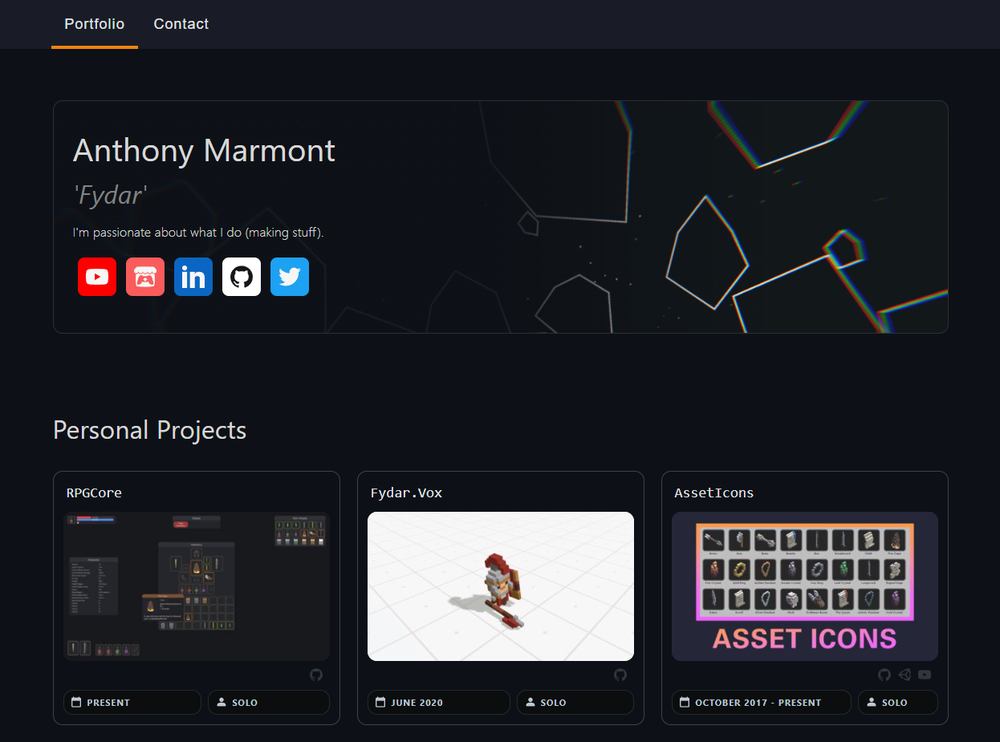

<h1>

Portfolio
</h1>

 

An **[ASP.NET Core](https://dotnet.microsoft.com/apps/aspnet)** application hosting my porfolio.

## 🔍 Overview

Content for my portfolio is authored into the *'Content'* directory using [RPGCore.Projects](https://github.com/Fydar/RPGCore/tree/main/src/libs/RPGCore.Projects).

### 🎨 Patio

CSS styling for my website is created using a CSS library of my creation called _'Patio_.

### 📦 RPGCore

This project utilises a couple of libraries from [**RPGCore**](https://github.com/Fydar/RPGCore); a framework for producing data-driven mechanics.

> \
> Used for polymorphic data serialization.

> \
> Used for editing website data files.

> \
> Used for loading pre-packaged portfolio content.

> \
> Used for authoring and building pre-packaged portfolio content.

### 📦 LettuceEncrypt

This project utilises [LettuceEncrypt](https://github.com/natemcmaster/LettuceEncrypt) to support SSL certicifates and HTTPS.

## License

This work is licensed under a [Creative Commons Attribution-NonCommercial 4.0 International License](http://creativecommons.org/licenses/by-nc/4.0/).
