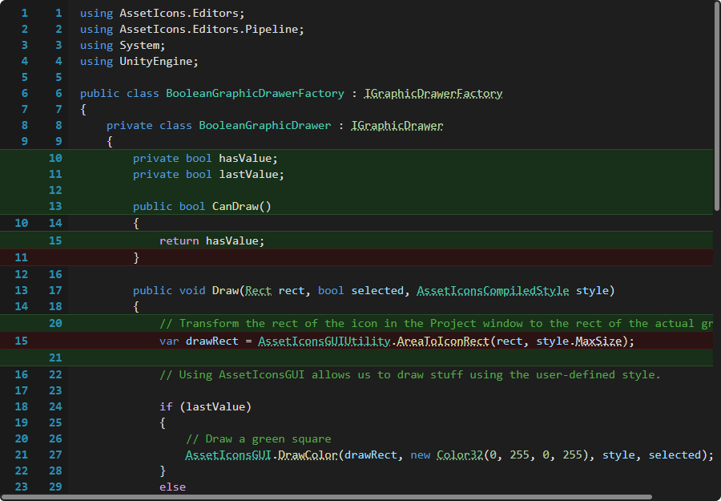
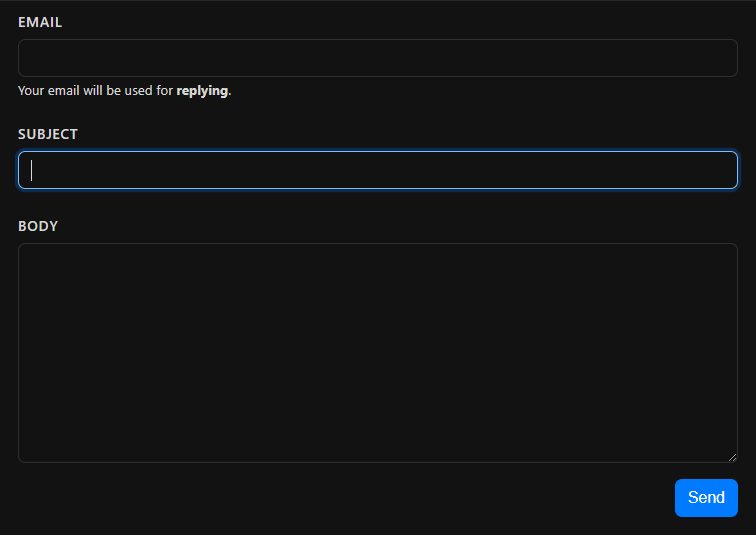
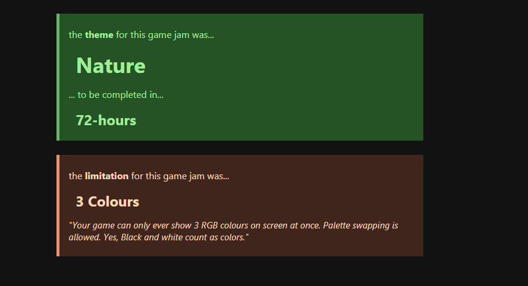

<h1>

Patio
</h1>

## 🔍 Overview

Styling for my portfolio website is done using a CSS library called _'Patio'_.

### 🎨 patio.component.code.css

   
  <i>CSharp with syntax highlighting and diffing lines.</i>

### 🎨 patio.component.forms.css

   
  <i>Dark theme contact form.</i>

### 🎨 patio.component.alerts.css

   
  <i>Dark theme with some alerts.</i>

